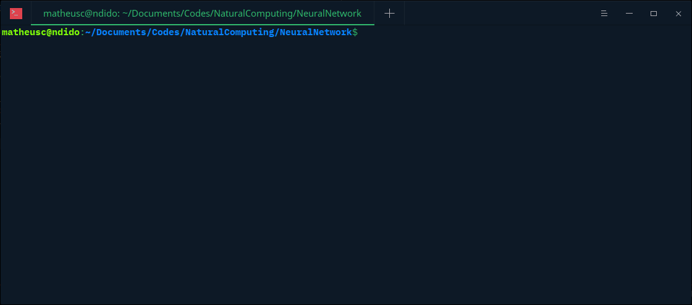

# ANN implemented in C++ and Python


### Usage
#### C++

Activations functions:
```C++
    auto logisticFunction = new ann::LogisticFunction{1};
    auto tanhFunction = new ann::HyperbolicTangentFunction{};
    auto arctanFunction = new ann::ArctanFunction{};
    // Others implemented activation functions are:
    //      LinearFunction
    //      StepFunction
    //      You can add other just overring the base class.
```

Creating a network:
```c++
    // Layout: 1 × 32 × 1.
    // Activation Functions: arctan, arctan, respectively.
    ann::MLPNetwork network{
        {1, 32, 1},
        {arctanFunction, arctanFunction}};

    // Initializing matrices.
    network.initializeTraining();
```

Training:
```C++
for (int i = 0; i < 200000; ++i) {
        double x = dis(gen);
        double y = sin(x);
        // A vector as input and a vector as output.
        // η ─ learning rate ─ is 0.1.
        network.train({x}, {y}, .1);
    }
```

Predicting:
```C++
    for (int i = 0; i < 20; ++i) {
        auto x = dis(gen);
        auto y = sin(x);

        // The argument is the input. The response is a vector
        // whose size is equal the output layer.
        auto predicted = network.predict({x});
        auto error = predicted[0] - y;

        std::cout << std::setprecision(12);
        std::cout << "sin(" << std::setw(15) << x << ") = "
                  << std::setw(15) << y << " ANN says: "
                  << std::setw(15) << predicted[0] << " error of "
                  << std::setw(18) << error << std::endl;
    }
```

#### Python

Creating the network:
```Python
net = network_t([2, 2, 1])
```
Initializing the network:
```Python
net.initilizalize()
```
Training:
```Python
# Teaching XOR-gate.
print("Training...")
for i in range(10000):
    a = randint(0, 1)
    b = randint(0, 1)
    y = xor(a, b)
    net.train([a, b], [y], .5)
```

Testing:
```Python
print("\n\nPredicting...")
print("\tpredicted: %.3lf expected %d"%(net.predict([1, 1])[0], 0))
print("\tpredicted: %.3lf expected %d"%(net.predict([1, 0])[0], 1))
print("\tpredicted: %.3lf expected %d"%(net.predict([0, 0])[0], 0))
print("\tpredicted: %.3lf expected %d"%(net.predict([0, 1])[0], 1))
```
Result
```bash
Training...


Predicting...
        predicted: 0.047 expected 0
        predicted: 0.960 expected 1
        predicted: 0.049 expected 0
        predicted: 0.960 expected 1
```

### Building

```bash
    git clone https://github.com/MatheusCTeixeira/ANN.git
    cd ANN
    cmake .
    make
```

### Future work
- Implement optimizers (https://keras.io/optimizers/).
- Weights exportation and importation.

### Demonstration

Training for sine-function prediction.
Architeture: 1 × 32 × 1
Activate functions: arctan, arctan


